# ONBOARDING

## Overview

`./Python` is the `TheAlgorithms/Python` repository: a large educational codebase of algorithms and data structures implemented in Python.

The goal of the repo is learning. It is not organized as a single application or reusable package with one main entry point. Instead, it is a collection of independent implementations grouped by topic. Most files are designed to be read in isolation and typically include:

- one or more functions or classes
- type hints
- explanatory docstrings
- doctests
- optional `__main__` blocks for local execution

This means the repo is best understood as a curated library of examples plus contribution rules and automation around quality.

## Folder Structure

```mermaid
flowchart TD
    A["Python/"] --> B["README.md"]
    A --> C["CONTRIBUTING.md"]
    A --> D["DIRECTORY.md"]
    A --> E["pyproject.toml"]
    A --> F[".github/workflows/"]
    A --> G["docs/"]
    A --> H["scripts/"]
    A --> I["sorts/"]
    A --> J["searches/"]
    A --> K["graphs/"]
    A --> L["data_structures/"]
    A --> M["dynamic_programming/"]
    A --> N["maths/"]
    A --> O["strings/"]
    A --> P["machine_learning/"]
    A --> Q["project_euler/"]
    A --> R["web_programming/"]
```



The top level is organized by subject area. Common folders include:

- `sorts/`: sorting algorithms such as bubble sort, merge sort, quick sort
- `searches/`: search algorithms and related optimization/search techniques
- `graphs/`: graph algorithms
- `data_structures/`: linked lists, heaps, tries, binary trees, suffix trees, and more
- `dynamic_programming/`: classic dynamic programming problems
- `maths/`: numerical and mathematical algorithms
- `strings/`: string processing and pattern matching
- `machine_learning/`: educational ML implementations
- `project_euler/`: solutions to Project Euler problems
- `web_programming/`: scripts related to web-oriented tasks
- `scripts/`: repo maintenance and automation scripts
- `docs/`: Sphinx documentation configuration

Important repo-level files:

- `README.md`: high-level project description
- `CONTRIBUTING.md`: contributor expectations and coding standards
- `DIRECTORY.md`: autogenerated catalog of algorithms by category
- `pyproject.toml`: Python version, dependencies, linting, tests, coverage, and docs config
- `.github/workflows/`: CI definitions for tests, linting, docs, and automation

## Key Modules

These files are the best anchors for understanding how the repo works:

- `README.md`
  Explains the repo’s purpose: algorithms implemented in Python for education.

- `CONTRIBUTING.md`
  Defines what counts as a valid contribution. This is one of the most important files in the repo because it establishes the design style:
  type hints, descriptive names, doctests, exceptions on bad input, limited side effects, and readable code.

- `DIRECTORY.md`
  Works as the practical table of contents for the repository. Because the repo is large, this file is often the fastest way to find examples by domain.

- `pyproject.toml`
  Central configuration for:
  - Python version requirement
  - dependencies
  - `pytest`
  - `ruff`
  - `mypy`
  - coverage
  - Sphinx/AutoAPI docs

- `scripts/build_directory_md.py`
  Generates `DIRECTORY.md`. Useful if you want to understand how the repo indexes algorithm files.

- `scripts/validate_filenames.py`
  Enforces naming rules across the repo.

- `scripts/validate_solutions.py`
  Validates `project_euler/` solutions against stored hashes.

- `.github/workflows/build.yml`
  Shows the canonical CI test run. This is the closest thing to the repo’s operational contract.

## Example Explanation

A good first example is `sorts/bubble_sort.py`.

Why this file is a useful starting point:

- the algorithm is simple
- the file is short
- it follows the repo’s typical structure
- it includes doctests that document expected behavior

Core idea of the iterative version:

```python
def bubble_sort_iterative(collection: list[Any]) -> list[Any]:
    length = len(collection)
    for i in reversed(range(length)):
        swapped = False
        for j in range(i):
            if collection[j] > collection[j + 1]:
                swapped = True
                collection[j], collection[j + 1] = collection[j + 1], collection[j]
        if not swapped:
            break
    return collection
```

How it works:

1. It repeatedly scans the list from left to right.
2. Adjacent elements are compared.
3. If two neighbors are out of order, they are swapped.
4. After each full pass, the largest remaining unsorted value has moved toward the end.
5. If a pass makes no swaps, the list is already sorted and the function exits early.

What this example teaches about the repo:

- implementations are usually self-contained
- examples are documented with doctests instead of separate tutorial text
- correctness and readability matter as much as the algorithm itself

## Learning Path

Use this sequence to onboard efficiently:

1. Read `README.md` to understand the project’s scope.
2. Read `CONTRIBUTING.md` carefully. This repo’s conventions are strict and shape almost every file.
3. Scan `DIRECTORY.md` to see how the repository is organized.
4. Start with simple categories:
   - `sorts/`
   - `searches/`
   - `strings/`
5. Read a few representative files and look for the recurring pattern:
   - function signature
   - docstring
   - doctests
   - input validation
   - optional `__main__`
6. Move next to intermediate areas:
   - `data_structures/`
   - `graphs/`
   - `dynamic_programming/`
7. Leave heavier or more specialized areas for later:
   - `machine_learning/`
   - `computer_vision/`
   - `web_programming/`
   - `project_euler/`
8. Review `pyproject.toml` and `.github/workflows/build.yml` to understand how code quality is enforced.
9. If you plan to contribute, run the same local checks the repo expects:
   - `uv sync --group=test`
   - `uvx ruff check .`
   - `uv run pytest --doctest-modules`

## Practical Starting Point

If you only have 30 minutes:

1. Read `README.md`
2. Read `CONTRIBUTING.md`
3. Open `DIRECTORY.md`
4. Study `sorts/bubble_sort.py`
5. Study one file from `graphs/` and one from `data_structures/`

That gives you a reliable mental model of how the repo is structured and how contributions are expected to look.
